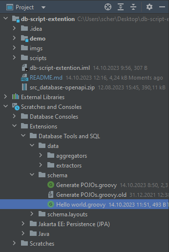
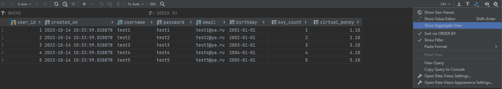
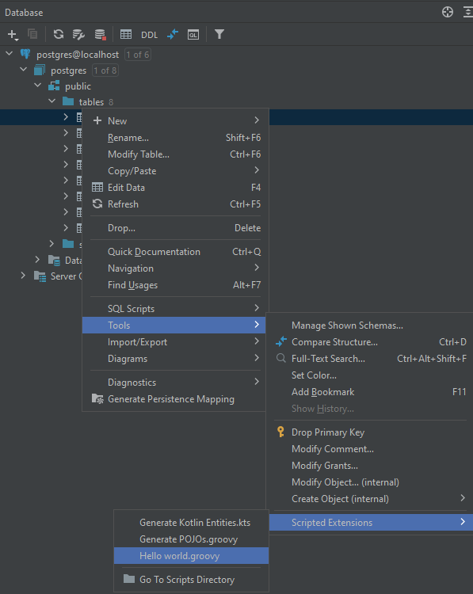
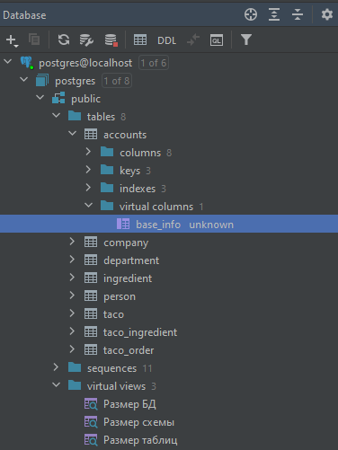

# IntelliJ IDEA Scripted Extension


Инструмент похожий на плагин.
Несколько строк кода Groovy и можно что-то сделать с таблицами и их данными.
Scripted Extension — простой скрипт Groovy, состоящий из одного файла. 
Однако IDEA не даст вам много возможностей для отладки или разумного завершения кода.

[src_database-openapi.zip](src_database-openapi.zip) - этот ZIP-архив содержит исходный код расширения OpenAPI.
Поскольку для скриптовых расширений не существует опубликованного JavaDoc API, 
изучение OpenAPI является основным источником информации.

OpenAPI
---
### SchemaGeneratorBindings
```java
public final class SchemaGeneratorBindings {
    //проект, который в данный момент открыт
    public static final Binding<Project> PROJECT = new Binding<>("PROJECT");
    //коллекция объектов, выбранных пользователем
    public static final Binding<JBIterable<DasObject>> SELECTION = new Binding<>("SELECTION");
    //буфер обмена
    public static final Binding<Clipboard> CLIPBOARD = new Binding<>("CLIPBOARD");
    //журнал логов
    public static final Binding<ScriptLogger> LOG = new Binding<>("LOG");
    //сохранения файлов
    public static final Binding<Files> FILES = new Binding<>("FILES");
}
```
### Log
По умолчанию LOG записывает все в IntelliJ IDEA Log (Help|Open Log in Editor|idea.log).
```java
public interface ScriptLogger {
  void print(@NotNull String message);
  void error(@NotNull String message);
  void error(@NotNull String message, @Nullable Throwable th);
}
```
### Clipboard
```java
public interface Clipboard {
  String get();
  void set(String text);
}
```
### Files
```java
public interface Files {
  void chooseFileAndSave(String title, String description, Consumer<File> saveAction);
  void chooseDirectoryAndSave(String title, String description, Consumer<File> saveAction);
  void refresh(File file);
}
```
---
### DasUtil
Статические методы:  
getCatalog, getSchema, isPrimary, isForeign, hasAttribute, getPrimaryKey, getColumns и т.д.
### Das_
Все дерево базы данных представлено com.intellij.database.model.Das_ объектами.

Часто используемые интерфейсы:
* DasNamed - getName, getKind(SCHEMA, TABLE, COLUMN и т.д.)
* DasObject - getComment, getDasParent, getDasChildren
* DasSchemaChild - дочерний элемент схемы
* DasTable - таблица
* DasTableChild - дочерний элемент таблицы
* DasColumn - колонка
* DasConstraint - ограничения
* DasTableKey - ключ isPrimary
* DasForeignKey - внешний ключ getRefTableName


---
### Hello world
```groovy
//ru language is not support
//ru language is not support
FILES.chooseDirectoryAndSave(//Show window for select folder for saving
        "Export", //title
        "Export the results" //description
) { directory -> //saveAction
    def file = new File(directory, "results.txt") //save file results.txt in selected folder
    file << "Export completed!" //save file with this text
    LOG.print("Hello world!") //info
    LOG.error("Export completed!") //warn
}
```

### [aggregators](..%2F..%2FAppData%2FRoaming%2FJetBrains%2FIntelliJIdea2023.2%2Fextensions%2Fcom.intellij.database%2Fdata%2Faggregators)


### [extractors](..%2F..%2FAppData%2FRoaming%2FJetBrains%2FIntelliJIdea2023.2%2Fextensions%2Fcom.intellij.database%2Fdata%2Fextractors)
Экспорт данных бд в CSV, JSON и SQL Insert и т.д.
Можно написать скрипт для экспорта в кастомный формат.
```groovy
/*
 * Available context bindings:
 *   COLUMNS     List<DataColumn>
 *   ROWS        Iterable<DataRow>
 *   OUT         { append() }
 *   FORMATTER   { format(row, col); formatValue(Object, col); getTypeName(Object, col); isStringLiteral(Object, col); }
 *   TRANSPOSED  Boolean
 * plus ALL_COLUMNS, TABLE, DIALECT
 *
 * where:
 *   DataRow     { rowNumber(); first(); last(); data(): List<Object>; value(column): Object }
 *   DataColumn  { columnNumber(), name() }
 */
OUT.append("START")
OUT.append("\n")
COLUMNS.each { col ->
    OUT.append(col.name())
    OUT.append(", ")
}
OUT.append("\n")
ROWS.each { row ->
    COLUMNS.each { col ->
        OUT.append(FORMATTER.format(row, col))
        OUT.append(", ")
    }
    OUT.append("\n")
}
OUT.append("END")
```

### [schema](..%2F..%2FAppData%2FRoaming%2FJetBrains%2FIntelliJIdea2023.2%2Fextensions%2Fcom.intellij.database%2Fschema)
Скрипты для преобразования метаданных таблицы в DTO, Entity и т.д.



### Скрипты:
[scripts](scripts)

### Ссылки:
* https://github.com/novotnyr/mybatis-idea-scripted-extension
* https://programmer.group/5d6399803e956.html

### virtual columns and virtual views



* https://www.jetbrains.com/help/idea/virtual-columns.html
* https://www.jetbrains.com/help/idea/virtual-views.html
